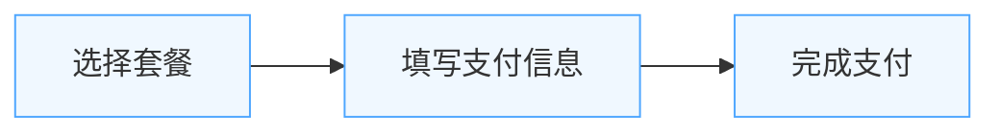

# NyxTrans商业模式与付费流程综合方案

## 执行摘要

本方案为NyxTrans简化版MVP提供了全面的商业模式、定价策略和付费流程设计。NyxTrans作为一款面向独立开发者和小团队的国际化工具，其商业模式需要平衡产品价值与目标用户的支付能力。

经过分析，我们建议采用**Freemium（免费增值）+ SaaS订阅**的混合商业模式，通过分层定价满足不同用户需求，并设计了流畅、直观的付费流程，以实现从免费用户到付费用户的自然转化。

本方案的核心优势包括：
- 低门槛的免费版本，便于用户快速采用
- 基于价值的分层定价，满足不同规模团队需求
- 简单直观的付费流程，降低转化摩擦
- 灵活的AI翻译计费模式，适应不同使用场景
- 可持续的增长路径，支持产品长期发展

## 1. 商业模式设计

### 1.1 目标用户分析

NyxTrans的目标用户主要包括：

**独立开发者**
- 特点：个人或极小团队，预算有限，需求简单
- 痛点：希望快速实现国际化，无需深入学习复杂技术
- 支付意愿：偏低，但对提高效率的工具有一定支付意愿

**小型开发团队（2-10人）**
- 特点：资源有限，但有明确的国际化需求
- 痛点：缺乏专业国际化人员，需要高效且经济的解决方案
- 支付意愿：中等，愿意为提高团队效率支付合理费用

**成长型创业公司**
- 特点：团队规模逐渐扩大，产品开始走向国际市场
- 痛点：需要更系统化的国际化解决方案，但预算仍有限
- 支付意愿：较高，愿意为专业工具支付溢价

### 1.2 商业模式选择

经过分析，我们为NyxTrans推荐采用**Freemium（免费增值）+ SaaS订阅**的混合商业模式：

#### 1.2.1 Freemium模式优势

- **降低采用门槛**：免费版本允许用户无风险尝试，加速产品传播
- **自然用户增长**：通过口碑传播扩大用户群，降低获客成本
- **基于价值转化**：用户体验到价值后，更愿意升级到付费版本

#### 1.2.2 SaaS订阅优势

- **稳定收入**：提供可预测的经常性收入，支持持续产品开发
- **客户终身价值**：长期订阅关系提高客户生命周期价值
- **灵活升级路径**：用户可随业务增长平滑升级到更高级别套餐

#### 1.2.3 AI翻译的增值模式

AI翻译作为NyxTrans的核心差异化功能，采用混合计费模式：

- 基础套餐包含一定的月度AI翻译额度
- 超出额度后可按需购买额外翻译包
- 高级AI模型作为高级套餐的专属功能

这种模式既保证了基础功能的可用性，又为高级用户提供了更优质的服务选择。

### 1.3 竞争差异化策略

NyxTrans在商业模式上的差异化主要体现在：

1. **专注细分市场**：专为独立开发者和小团队设计，而非大型企业
2. **简单透明定价**：避免复杂的计量和隐藏费用，降低决策成本
3. **AI翻译集成**：将AI翻译无缝集成到工作流中，提供一站式解决方案
4. **开发者友好**：商业模式设计考虑开发者使用习惯，如CLI工具免费使用

## 2. 定价策略

### 2.1 定价模型

NyxTrans采用基于价值的分层定价模型，通过不同套餐满足不同用户需求：

#### 2.1.1 定价层级

| 版本 | 目标用户 | 主要特点 |
|------|----------|---------|
| **免费版** | 个人开发者、学习者 | 基础功能，适用于小型项目 |
| **标准版** | 独立开发者、小型团队 | 完整功能，适中使用限制 |
| **专业版** | 小型团队、创业公司 | 高级功能，较少使用限制 |
| **企业版** | 成长型公司、特殊需求 | 定制支持，几乎无限制 |

#### 2.1.2 价格结构

| 特性 | 免费版 | 标准版 | 专业版 | 企业版 |
|------|-------|--------|-------|--------|
| 价格 | ¥0/月 | ¥99/月 | ¥299/月 | 联系销售 |
| 年付价格 | - | ¥999/年 | ¥2,999/年 | 定制 |
| 项目数量 | 1 | 3 | 10 | 无限 |
| 文本条目 | 500 | 5,000 | 20,000 | 无限 |
| 支持语言 | 3 | 10 | 30 | 全部 |
| 团队成员 | 1 | 5 | 15 | 无限 |
| AI翻译额度 | 5,000字符/月 | 50,000字符/月 | 200,000字符/月 | 定制 |

### 2.2 定价策略可视化

下图展示了不同套餐的价格与价值关系：


### 2.3 额外购买选项

除基本订阅外，NyxTrans还提供以下额外购买选项：

#### 2.3.1 AI翻译额度包

为满足不同翻译需求，提供灵活的额度包选择：

| 额度包 | 字符数 | 价格 | 单价 |
|-------|-------|------|------|
| 小额度包 | 10万字符 | ¥49 | ¥0.00049/字符 |
| 中额度包 | 50万字符 | ¥199 | ¥0.000398/字符 |
| 大额度包 | 200万字符 | ¥699 | ¥0.0003495/字符 |

#### 2.3.2 专业服务

针对特殊需求，提供额外的专业服务：

- **人工翻译审校**：¥0.15/字符起
- **本地化咨询**：¥1,500/次起
- **定制开发**：根据需求定价

### 2.4 定价心理学应用

NyxTrans的定价策略应用了以下定价心理学原理：

1. **锚定效应**：通过展示企业版的高价值，使专业版显得更具性价比
2. **价格层级**：标准版与专业版的价格比例约为1:3，符合经典的"好、更好、最好"定价模式
3. **简化决策**：限制套餐数量为3+1（三个标准套餐+一个定制套餐），避免选择困难
4. **年付折扣**：提供约16%的年付折扣，鼓励长期订阅

## 3. 付费流程设计

### 3.1 付费触点设计

NyxTrans的付费触点设计遵循"自然引导"原则，在用户体验到产品价值后自然引导其考虑升级：

#### 3.1.1 自然使用限制触点

当用户接近或达到免费版限制时，系统会显示友好提醒：


*图示：当用户项目数接近限制时的提醒界面*

#### 3.1.2 价值体验后触点

在用户体验到产品核心价值后显示升级信息：

```
+------------------------------------------+
|                                          |
|    ✓ 文本提取完成！                       |
|    已成功提取并替换 328 处文本             |
|    预计节省了约 5.5 小时的手动工作         |
|                                          |
|    升级到标准版，解锁更多项目和语言支持     |
|                                          |
|    [了解更多]        [稍后提醒]           |
|                                          |
+------------------------------------------+
```

#### 3.1.3 功能探索区

在产品界面中设置"功能探索区"，展示高级功能：

```
+------------------------------------------+
|              功能探索                    |
+------------------------------------------+
|                                          |
|  [PRO] 高级AI翻译                        |
|  使用专业翻译模型，提高翻译质量            |
|                                          |
|  [PRO] 团队协作                          |
|  邀请团队成员共同管理翻译项目              |
|                                          |
|  [PRO] 翻译记忆库                        |
|  智能复用历史翻译，提高一致性              |
|                                          |
|  [查看全部高级功能]                       |
|                                          |
+------------------------------------------+
```

### 3.2 付费流程

NyxTrans的付费流程设计为简单的三步流程：



#### 3.2.1 套餐选择页面

套餐选择页面是用户做出购买决策的关键环节：

```
+------------------------------------------+
|             选择最适合您的方案            |
+------------------------------------------+
|                                          |
|  +--------+    +--------+    +--------+  |
|  | 免费版  |    | 标准版  |    | 专业版  |  |
|  +--------+    +--------+    +--------+  |
|                 推荐方案                  |
|                                          |
|    1个项目       3个项目      10个项目    |
|   500条文本     5000条文本   20000条文本  |
|    3种语言      10种语言      30种语言    |
|    1个成员       5个成员      15个成员    |
|                                          |
|      --        ¥99/月       ¥299/月     |
|      --       ¥999/年      ¥2999/年     |
|                                          |
|   当前使用     [立即升级]    [立即升级]   |
|                                          |
+------------------------------------------+
|    常见问题 | 需要帮助？联系我们          |
+------------------------------------------+
```

#### 3.2.2 支付信息页面

支付信息页面应简洁明了，专注于完成交易：

```
+------------------------------------------+
|                支付信息                   |
+------------------------------------------+
|                                          |
|  订单摘要                                |
|  - 套餐: 专业版                          |
|  - 周期: 年付                            |
|  - 价格: ¥2,999/年                       |
|  - 优惠: -¥299                           |
|  - 总计: ¥2,700                          |
|                                          |
|  支付方式                                |
|  O 信用卡                                |
|  O 支付宝                                |
|  O 微信支付                              |
|  O 对公转账                              |
|                                          |
|  [需要发票]                              |
|                                          |
|  [完成支付]        [返回]                |
|                                          |
+------------------------------------------+
```

#### 3.2.3 支付成功页面

支付成功页面强化用户决策的正确性，并引导下一步操作：

```
+------------------------------------------+
|                                          |
|               ✓                         |
|           支付成功！                     |
|                                          |
|  您已成功升级到专业版，有效期至2026-07-22  |
|                                          |
|  新增功能：                              |
|  - 高级AI翻译                            |
|  - 10个项目额度                          |
|  - 30种支持语言                          |
|  - 团队协作功能                          |
|                                          |
|  [开始使用新功能]  [查看使用指南]         |
|                                          |
+------------------------------------------+
```

### 3.3 支付系统集成

为满足不同地区用户的需求，NyxTrans将集成多种支付方式：

#### 3.3.1 全球支付方案

- **Stripe**：处理信用卡和国际支付
- **PayPal**：提供全球广泛支持的支付选项

#### 3.3.2 中国市场支付方案

- **支付宝**：覆盖中国个人用户
- **微信支付**：覆盖中国移动支付用户
- **银联**：支持中国发行的信用卡和借记卡

#### 3.3.3 企业支付方案

- **对公转账**：支持企业客户的采购流程
- **发票系统**：提供增值税专用发票和电子发票

## 4. 转化率优化策略

### 4.1 免费用户转化策略

针对免费用户的转化策略主要包括：

#### 4.1.1 基于使用量的转化

- **接近限制提醒**：当用户接近免费版限制时，友好提醒并推荐升级
- **限制体验**：让用户体验到限制，但不影响核心功能使用

#### 4.1.2 基于价值的转化

- **价值量化**：展示用户已节省的时间或提高的效率
- **案例分享**：展示类似用户通过升级获得的收益

#### 4.1.3 促销转化

- **首次升级优惠**：为首次升级的用户提供特别折扣
- **限时促销**：在特定时期（如产品更新、节假日）提供促销

### 4.2 UI/UX优化

通过界面设计提高转化率：

#### 4.2.1 视觉层次优化

- 使用颜色和大小强调推荐套餐
- 为CTA按钮使用对比色，增强视觉吸引力

#### 4.2.2 摩擦减少

- 简化付费表单，减少必填字段
- 提供多种支付选项，适应不同用户习惯
- 实现"一键升级"，减少决策步骤

### 4.3 个性化推荐

基于用户行为提供个性化的套餐推荐：

- 分析用户使用模式，预测其需求
- 基于当前使用量推荐最合适的套餐
- 为长期活跃的免费用户提供专属优惠

## 5. 留存与续费策略

### 5.1 价值持续传递

确保付费用户持续感受到产品价值：

#### 5.1.1 使用情况报告

定期发送使用情况摘要邮件，展示用户通过NyxTrans获得的价值：

```
+------------------------------------------+
|        NyxTrans 月度使用报告             |
+------------------------------------------+
|                                          |
|  亲爱的用户，                            |
|                                          |
|  本月您通过NyxTrans：                    |
|  - 处理了 3 个项目                       |
|  - 翻译了 1,245 条文本                   |
|  - 支持了 5 种语言                       |
|  - 节省了约 20 小时的手动工作            |
|                                          |
|  [查看详细报告]                          |
|                                          |
+------------------------------------------+
```

#### 5.1.2 新功能通知

优先向付费用户推送新功能更新和使用建议：

- 提前访问新功能的权限
- 专属的功能使用教程和最佳实践
- 定期的产品路线图更新

### 5.2 续费优化

提高续费率的关键策略：

#### 5.2.1 提前通知

在到期前发送分阶段的续费提醒：

- 到期前30天：友好提醒，强调续费价值
- 到期前15天：提供续费优惠或升级建议
- 到期前7天：强调即将失去的功能和数据

#### 5.2.2 续费激励

为鼓励续费提供特别优惠：

- 长期用户专属折扣
- 升级优惠（如同价升级到更高套餐）
- 额外福利（如增加AI翻译额度）

## 6. 实施路线图

### 6.1 MVP阶段（1-3个月）

在产品MVP阶段，实现基础商业功能：

- 实现基础的免费/付费功能区分
- 集成Stripe等主流支付网关
- 设计并实现简单的套餐页面
- 建立基础的使用量统计系统

### 6.2 成长阶段（3-6个月）

随着用户基础的增长，完善商业系统：

- 增加更多支付方式（支付宝、微信支付等）
- 实现完整的订阅管理功能
- 开发账单和发票系统
- 设计并实施初步的转化率优化策略

### 6.3 优化阶段（6-12个月）

基于数据和用户反馈，持续优化商业模式：

- 实施A/B测试，优化付费页面和流程
- 开发个性化推荐系统
- 完善留存和续费策略
- 探索新的收入来源（如API访问、高级服务等）

## 7. 关键指标与监控

### 7.1 商业健康指标

监控以下关键指标评估商业模式的健康状况：

#### 7.1.1 获客指标

- **客户获取成本(CAC)**：获取一个付费用户的平均成本
- **免费-付费转化率**：免费用户转为付费用户的比例
- **访问-注册转化率**：网站访问者注册账号的比例

#### 7.1.2 收入指标

- **月度经常性收入(MRR)**：每月稳定的订阅收入
- **平均收入/用户(ARPU)**：每个用户带来的平均收入
- **客户生命周期价值(LTV)**：一个客户在整个使用期间带来的总收入

#### 7.1.3 留存指标

- **续订率**：付费用户继续订阅的比例
- **净收入留存率(NRR)**：考虑升级和降级后的收入留存率
- **客户流失率**：取消订阅的用户比例

### 7.2 指标目标

以下是NyxTrans在不同阶段的指标目标：

| 指标 | MVP阶段(3个月) | 成长阶段(1年) | 成熟阶段(2年+) |
|------|--------------|-------------|--------------|
| 免费-付费转化率 | 2-3% | 5-7% | 8-10% |
| 月度经常性收入 | ¥10万 | ¥50万 | ¥200万+ |
| 客户获取成本 | ¥500-800 | ¥300-500 | ¥200-400 |
| 续订率 | 60% | 75% | 85%+ |
| LTV:CAC比率 | 1.5:1 | 3:1 | 5:1+ |

## 8. 风险与应对策略

### 8.1 主要风险

NyxTrans商业模式面临的主要风险包括：

#### 8.1.1 市场风险

- **竞争加剧**：大型企业进入小团队市场细分
- **价格敏感**：目标用户对价格变化高度敏感

#### 8.1.2 产品风险

- **价值感知**：用户可能难以量化国际化工具的价值
- **功能期望**：付费用户对功能的期望可能过高

#### 8.1.3 运营风险

- **AI成本波动**：AI翻译服务的成本可能波动
- **支付合规**：不同地区的支付合规要求各异

### 8.2 应对策略

针对上述风险，建议采取以下应对策略：

#### 8.2.1 差异化策略

- 强化对独立开发者和小团队的专注
- 提供大型竞争对手难以匹配的个性化服务和灵活性

#### 8.2.2 价值展示策略

- 开发ROI计算器，帮助用户量化收益
- 收集并展示用户成功案例和节省时间的数据

#### 8.2.3 成本控制策略

- 与多家AI服务提供商建立合作，降低依赖
- 实施AI使用配额和智能缓存，优化成本

## 9. 结论与建议

### 9.1 商业模式总结

NyxTrans的商业模式设计基于深入理解目标用户需求和市场环境，采用Freemium + SaaS订阅的混合模式，通过分层定价满足不同规模用户的需求，并通过AI翻译的增值服务创造额外收入来源。

这一商业模式的核心优势在于：
- 降低采用门槛，加速用户增长
- 基于价值的自然转化路径
- 可预测的经常性收入
- 灵活的扩展和升级路径

### 9.2 实施建议

为确保商业模式的成功实施，建议采取以下步骤：

1. **渐进实施**：
   - 先实现基础的免费/付费区分和简单支付流程
   - 随着用户增长逐步完善高级功能和付费选项

2. **持续验证**：
   - 通过用户访谈验证价格接受度
   - 使用A/B测试优化付费流程和转化率

3. **数据驱动**：
   - 建立关键指标监控系统
   - 基于数据调整商业策略和定价

4. **用户沟通**：
   - 清晰传达产品价值和定价逻辑
   - 提前沟通任何定价或政策变更

### 9.3 长期发展

随着NyxTrans的成长，商业模式可以朝以下方向发展：

1. **产品线扩展**：
   - 开发配套的国际化测试、分析工具
   - 提供更专业的本地化咨询服务

2. **市场扩展**：
   - 逐步向上市场，开发满足中型企业需求的功能
   - 探索垂直行业特定的国际化解决方案

3. **生态系统建设**：
   - 建立连接开发者和专业翻译人员的市场平台
   - 发展API和集成生态，成为国际化基础设施

通过这些策略，NyxTrans可以建立一个既满足用户需求，又支持产品可持续发展的商业模式，为独立开发者和小团队提供真正有价值的国际化解决方案。
